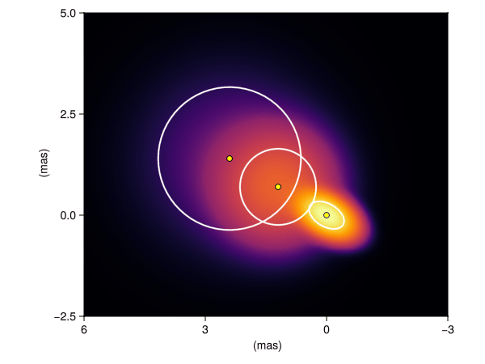
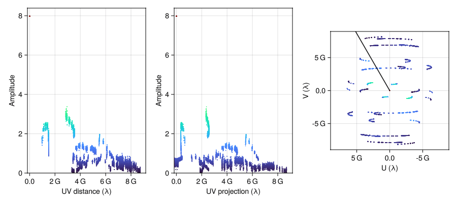
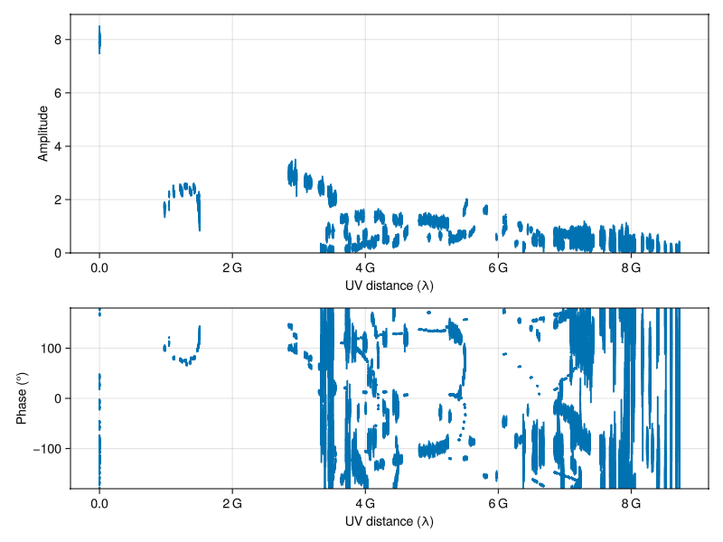
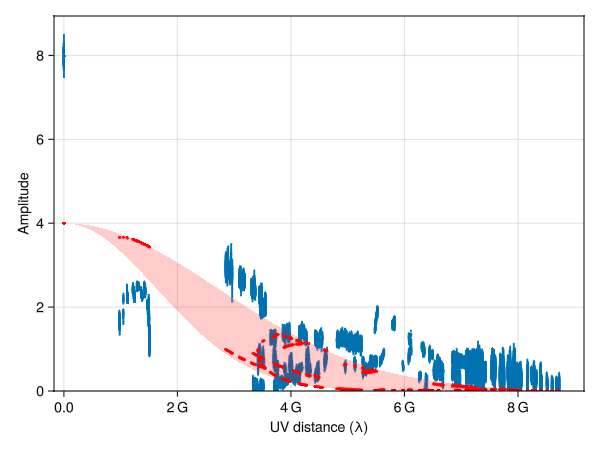

# VLBIPlots.jl 🌌

Convenient plotting utilities for very long baseline interferometry (VLBI) data and models.

## Overview 📊

`VLBIPlots` provides two main categories of plotting functions:

1. **Model visualization** 🎯 for interferometric model components from [InterferometricModels.jl](https://github.com/JuliaAPlavin/InterferometricModels.jl)
2. **VLBI data visualization** 📡 for visibility data from [VLBIData.jl](https://github.com/JuliaAPlavin/VLBIData.jl) and [VLBIFiles.jl](https://github.com/JuliaAPlavin/VLBIFiles.jl)

The VLBI data plotting function names follow `difmap`'s classic plotting conventions:
- **RadPlot** 🎯: Radial visibility plots (amplitude/phase vs UV distance)
- **ProjPlot** 📐: Projected visibility plots (along specific baseline angles) 
- **UVPlot** 🗺️: UV coverage plots (sampling pattern visualization)

## Model Component Visualization 🎨

`VLBIPlots` provides seamless `Makie.jl` plotting support for geometric models. The package includes three complementary visualization methods:

- **Scatter plots** ⭐: Display component centers as points
- **Polygon plots** 🔲: Show component spatial extent as geometric shapes  
- **Image plots** 🖼️: Render intensity distributions as images

These plot types can be layered together to create comprehensive model visualizations:

```julia
using VLBIPlots
using InterferometricModels
using StaticArrays
using Unitful

# Create a three-component jet model (or load from file using VLBIFiles.jl)
model = MultiComponentModel([
    EllipticGaussian(flux=1.0, σ_major=0.4u"mas", ratio_minor_major=0.6, 
                     pa_major=π/3, coords=SVector(0.0, 0.0)u"mas"),
    CircularGaussian(flux=0.6, σ=0.8u"mas", coords=SVector(1.2, 0.7)u"mas"),
    CircularGaussian(flux=0.3, σ=1.5u"mas", coords=SVector(2.4, 1.4)u"mas")
])

# Create a comprehensive visualization combining all three plot types
fig = Figure()
ax = Axis(fig[1,1], limits=(-3..6, -2.5..5))

# Layer 1: Intensity image as background
image!(model, colormap=:inferno, colorscale=SymLog(0.03))

# Layer 2: Component boundaries as white outlines
poly!(model, color=(:white, 0), strokewidth=2, strokecolor=:white)

# Layer 3: Component centers as yellow markers
scatter!(model, markersize=8, color=:yellow, strokewidth=1, strokecolor=:black)
```




## VLBI Data Visualization 📡

### Quick Start ⚡

`VLBIPlots` builds on [MakieExtra.jl](https://github.com/JuliaAPlavin/MakieExtra.jl)'s powerful `FPlot` structure and supports various data structures, most notably uvtables of visibilities.

Here's a quick overview of the three main plot types:

```julia
using VLBIPlots
using VLBIFiles
import GLMakie
using MakieExtra

# Load real VLBI data
uvdata = VLBIFiles.load("path/to/your/data.uvfits")
uvtbl = uvtable(uvdata) |> VLBI.add_conjvis

# Common styling keywords
kws = (markersize=2, color=r -> U.value(abs(r.value)), colormap=:turbo)

# RadPlot: Radial visibility amplitude
axplot(scatter)(RadPlot(uvtbl; kws...))

# ProjPlot: Projected visibility amplitude at 30°
axplot(scatter)(ProjPlot(uvtbl, 30u"°"; kws...))

# UVPlot: UV coverage
axplot(scatter)(UVPlot(uvtbl; kws...))
```



### Detailed Examples 🔍

#### Composability 🧩

This section demonstrates `RadPlot` features, but the same composability principles apply to `ProjPlot` and `UVPlot` as well.

The plotting functions are designed with composability in mind:

- **`FPlot` structure** 🏗️ makes it easy to set styling or other options once and reuse them across plots
- **Flexible with data types** 🔄 - for example, you can directly plot uncertainties with rangebars, and `multiplot` from `MakieExtra` is perfect for combining different plot types

```julia
using VLBIPlots
using VLBIFiles
using GLMakie
using MakieExtra

# Load real VLBI data
uvdata = VLBIFiles.load("path/to/your/data.uvfits")
uvtbl = uvtable(uvdata)

# Create radial plots with shared styling
fplt = RadPlot(uvtbl; markersize=2)

# Visibility amplitude vs UV distance
multiplot((axplot(scatter), rangebars), fplt)

# Visibility phase vs UV distance  
multiplot((axplot(scatter), rangebars), 
         RadPlot(fplt; yfunc=rad2deg∘angle); 
         axis=(limits=(nothing, (-180, 180)),))
```



#### Model Comparison 🔬

You can easily overplot geometric model predictions on top of real data to compare them:

```julia
using InterferometricModels

# Create a simple model (e.g., elliptical Gaussian component)
model = EllipticGaussian(flux=4.0, σ_major=0.2u"mas", 
                        ratio_minor_major=0.6, pa_major=π/4, 
                        coords=SVector(0.0, 0.0)u"mas")

# Plot data and overplot model predictions
fplt = RadPlot(uvtbl; markersize=2)

# Amplitude plot with model overlay
multiplot((axplot(scatter), rangebars), fplt)
scatter!(RadPlot(uvtbl; model), markersize=3, color=:red)
band!(RadPlot(0..2e8; model), color=(:red, 0.3))
```




## Additional Resources 📚

For more usage examples, visit:
- [InterferometricModels.jl docs](https://aplavin.github.io/InterferometricModels.jl/test/examples.html) 
- [VLBIData.jl docs](https://aplavin.github.io/VLBIData.jl/test/examples.html)
